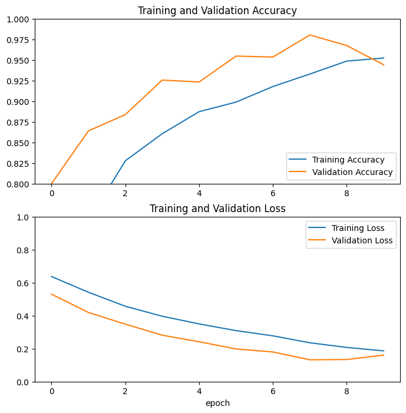

# PA_KB_KEL1_B2-20
<h1>Deteksi berkacamata dan tidak berkacamata</h1>

Link Dataset
<a>https://www.kaggle.com/datasets/jorgebuenoperez/datacleaningglassesnoglasses</a>

<b>Anggota</b>
<ul>
<li>Indro Dwi Saputro (2009106099)</li>
<li>Ricky Novenda Putra (2009106073)</li>
<li>Al Ikhwan Shafa (2009106078)</li>
</ul>

<h3>Hasil training model </h3>

